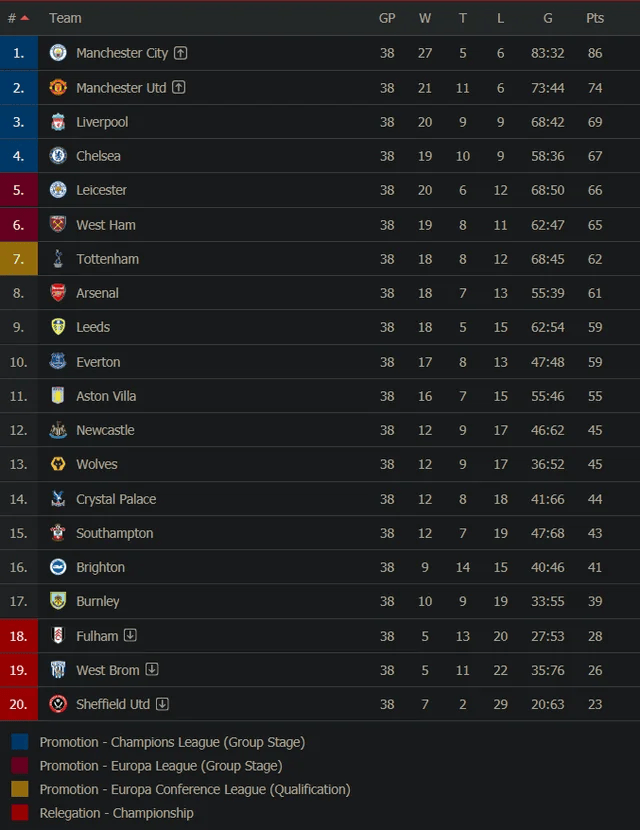

```{r setup, include=FALSE}
knitr::opts_chunk$set(echo = FALSE)
```

```{r}
library(ggplot2)
library(plotly)
library(treemapify)
library(gganimate)
library(gifski)    
library(viridis)
library(transformr) 
library(readr)
soccer_data <- read.csv("EPL_20_21.csv")
```

```{r}
teams <- list(
  ManCity = soccer_data[soccer_data$Club == "Manchester City", ],
  ManU = soccer_data[soccer_data$Club == "Manchester United", ],
  Liverpool = soccer_data[soccer_data$Club == "Liverpool FC", ],
  Chelsea = soccer_data[soccer_data$Club == "Chelsea", ],
  Leicester = soccer_data[soccer_data$Club == "Leicester City", ],
  WestHam = soccer_data[soccer_data$Club == "West Ham United", ],
  Tottenham = soccer_data[soccer_data$Club == "Tottenham Hotspur", ],
  Arsenal = soccer_data[soccer_data$Club == "Arsenal", ],
  Leeds = soccer_data[soccer_data$Club == "Leeds United", ],
  Everton = soccer_data[soccer_data$Club == "Everton", ],
  AstonVilla = soccer_data[soccer_data$Club == "Aston Villa", ],
  Newcastle = soccer_data[soccer_data$Club == "Newcastle United", ],
  Wolves = soccer_data[soccer_data$Club == "Wolverhampton Wanderers", ],
  CrystalPalace = soccer_data[soccer_data$Club == "Crystal Palace", ],
  Southampton = soccer_data[soccer_data$Club == "Southampton", ],
  Brighton = soccer_data[soccer_data$Club == "Brighton", ],
  Burnley = soccer_data[soccer_data$Club == "Burnley", ],
  Fulham = soccer_data[soccer_data$Club == "Fulham", ],
  WestBrom = soccer_data[soccer_data$Club == "West Bromwich Albion", ],
  Sheffield = soccer_data[soccer_data$Club == "Sheffield United", ]
)
```

```{r}
team_colors = c(
  "ManCity" = "#6CABDD",
  "ManU" = "#DA291C",
  "Liverpool" = "#c8102E",
  "Chelsea" = "#034694",
  "Leicester" = "#003090",
  "WestHam" = "#7A263A",
  "Tottenham" = "#132257",
  "Arsenal" = "#EF0107",
  "Leeds" = "#FFCD00",
  "Everton" = "#003399",
  "AstonVilla" = "#95bfe5",
  "Newcastle" = "#241F20",
  "Wolves" = "#FDB913",
  "CrystalPalace" = "#1B458F",
  "Southampton" = "#d71920",
  "Brighton" = "#0057B8",
  "Burnley" = "#6C1D45",
  "Fulham" = "#000000",
  "WestBrom" = "#122F67",
  "Sheffield" = "#EE2737"
)
```

```{r}
palette <- colorRampPalette(c("#00ff85", "#3D195B"))
```



The 20/21 Premier League season ended with Manchester City as champions, while Fulham, West Bromwich Albion, and Sheffield United were relegated. Let's take a look as to the statistics that differ between these teams and everyone else in the middle, seeing what statistics lead to a successful season and which ones did not. 

```{r}
goals_df <- data.frame(totalxG = sapply(teams, function(team) sum(team$xG*team$Matches)), Goals = sapply(teams, function(team) sum(team$Goals)),Names = names(teams))

ggplot(goals_df, aes(x = totalxG, y = Goals)) +
  geom_text(aes(label = Names), size = 3, color = team_colors) +
  xlab("Total xG") +
  ylab("Goals Scored") +
  xlim(42,95) +
  ggtitle("Scatterplot of Total xG vs Goals Scored by Club") +
  theme_minimal()
```

The first statistic that many people think of for a successful season are goals, as teams need to score to win. The scatterplot clearly shows that the best teams not only score the most goals, but also get into good positions to score and have the highest expected goals throughout the season. This is seen with the winners Man City having the highest of both statistics and the rest of the top teams positioned highly on the graph, while the relegated teams were all at or near the bottom for these statistics. 

```{r}
outfielders <- soccer_data[soccer_data$Goals >= 1, ]
outfielders$Primary_Position <- sub(",.*", "", outfielders$Position)
valid_positions <- c("GK", "DF", "MF", "FW")
outfielders <- outfielders[outfielders$Primary_Position %in% valid_positions, ]
outfielders$Primary_Position <- factor(outfielders$Primary_Position, levels = valid_positions)
outfielders$Club <- factor(outfielders$Club, levels = unique(outfielders$Club))

p <- ggplot(outfielders, aes(x = Mins, y = Goals, color = Primary_Position)) +
  geom_point(size = 3) +
  scale_x_log10() +
  transition_states(Club, transition_length = 10, state_length = 20) +
  xlim(0,3500) +
  scale_color_manual(values = palette(length(unique(outfielders$Primary_Position)))) +
  labs(title = "Goals vs. Minutes by Position for {closest_state}",
       x = "Minutes Played",
       y = "Goals Scored",
       color = "Primary Position") +
  theme_minimal()

animate(p, nframes = 300, fps = 5)
```

Who scores the goals, though? This animation shows a scatterplot of each teams player's goals scored vs. minutes played by position, and it clearly shows that it is typically forwards who score the most goals, although there are some clubs that have midfielders are their top scorers and one club (Liverpool) who had their goalie score! The top scorers also tended to play a lot of minutes during the season.

```{r}
pens_df <- data.frame(Pens = sapply(teams, function(team) sum(team$Penalty_Attempted)), Pens_Scored = sapply(teams, function(team) sum(team$Penalty_Goals)), Goals = sapply(teams, function(team) sum(team$Goals)), Names = names(teams))
pens_df$Convert_Rate = pens_df$Pens_Scored/pens_df$Pens

plot <- ggplot(pens_df, aes(x = Pens_Scored, y = Goals, size = Convert_Rate, 
  text = paste("Team:", Names, 
               "<br>Total Season Goals:", Goals,
               "<br>Penalties Attempted:", Pens,
               "<br>Penalties Scored:", Pens_Scored))) +
  geom_point(color = team_colors, alpha = 0.7) +
  scale_size_continuous(range = c(3,7)) +
  theme_minimal() +
  labs(title = "Total Goals vs. Penalty Goals by Conversion Rate",
    x = "Penalty Goals",
    y = "Total Season Goals",
    size = "Penalties Scored"
  )

ggplotly(plot, tooltip = "text")
```

One of the best opportunities to score in a game is if a team is awarded a penalty. This does not happen often, and most goals scored by teams are not penalties, but they can be vital to a game's result. The better teams tend to get more penalties and hence score more throughout the season as they are usually better at attacking and creating chances throughout games, but that does not mean they are the best at taking them. In fact, there is a wide distribution of conversion rates throughout the league, with a higher league finish not always related to a higher rate.

<div style="width: 100vw; margin-left: calc(-50vw + 50%);">
  <iframe
    src="https://abby-flynt.shinyapps.io/berkove/"
    width="100%"
    height="800px"
    style="border:none;">
  </iframe>
</div>

Another metric that people look at for success is age, and many of the best teams use a wide variety of ages to find the best combination of youthful, exciting players and older, more experiences players to perform well throughout the year. The histogram above also show the distribution of goals for each team, with once again higher goals typically leading to higher finishes.

```{r}
assists_df <- data.frame(totalxA = sapply(teams, function(team) sum(team$xA*team$Matches)), Assists = sapply(teams, function(team) sum(team$Assists)), Passes = sapply(teams, function(team) sum(team$Passes_Attempted)), Names = names(teams))

ggplot(assists_df, aes(area = Assists, fill = totalxA, label = Names)) +
  geom_treemap() +
  geom_treemap_text(color = "white", place = "center") +
  scale_fill_gradientn(colors = palette(100)) +
  labs(title = "Treemap of Club by Total xA and Assists", fill = "Total xA")
```

Similarly to scoring goals, players must be good at creating chances and getting assists. The best clubs have higher expected assists, which tends to lead to more actual assists and goals throughout the year.

```{r}
cards_df <- data.frame(YellowCards = sapply(teams, function(team) sum(team$Yellow_Cards)), RedCards = sapply(teams, function(team) sum(team$Red_Cards)),
                       Names = names(teams))

ggplot(cards_df, aes(area = YellowCards, fill = RedCards, label = Names)) +
  geom_treemap() +
  geom_treemap_text(color = "white", place = "center") +
  scale_fill_gradientn(colors = palette(100)) +
  labs(title = "Treemap of Club by Yellow and Red Cards Recieved", fill = "Red Cards")
```

Finally, what about discipline? It's best to avoid getting yellow cards and especially red cards to not play at a disadvantage throughout games. However, this plot shows a wide variety of yellow and red cards given to clubs who finished in all places, so while not the best, its okay if teams accumulates cards throughout the season.